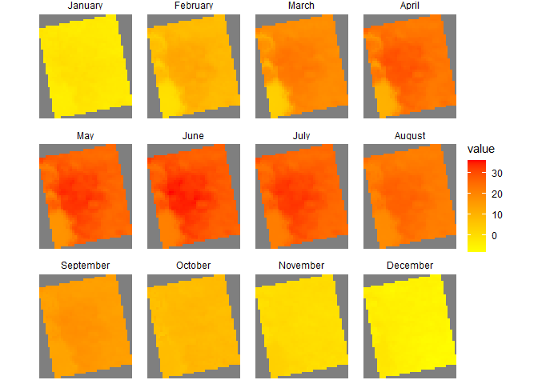

Case Study 10
================
Mia Giannini
November 9, 2021

# Load Packages

``` r
library(raster)
library(rasterVis)
library(rgdal)
library(ggmap)
library(tidyverse)
library(knitr)
library(ncdf4)
```

# Create new folder

``` r
dir.create("data",showWarnings = F)

lulc_url="https://github.com/adammwilson/DataScienceData/blob/master/inst/extdata/appeears/MCD12Q1.051_aid0001.nc?raw=true"
lst_url="https://github.com/adammwilson/DataScienceData/blob/master/inst/extdata/appeears/MOD11A2.006_aid0001.nc?raw=true"
```

# Download data and load into R

``` r
download.file(lulc_url,destfile="data/MCD12Q1.051_aid0001.nc", mode="wb")
download.file(lst_url,destfile="data/MOD11A2.006_aid0001.nc", mode="wb")

lulc=stack("data/MCD12Q1.051_aid0001.nc",varname="Land_Cover_Type_1")
```

    ## [1] ">>>> WARNING <<<  attribute latitude_of_projection_origin is an 8-byte value, but R"
    ## [1] "does not support this data type. I am returning a double precision"
    ## [1] "floating point, but you must be aware that this could lose precision!"
    ## [1] ">>>> WARNING <<<  attribute longitude_of_central_meridian is an 8-byte value, but R"
    ## [1] "does not support this data type. I am returning a double precision"
    ## [1] "floating point, but you must be aware that this could lose precision!"
    ## [1] ">>>> WARNING <<<  attribute longitude_of_projection_origin is an 8-byte value, but R"
    ## [1] "does not support this data type. I am returning a double precision"
    ## [1] "floating point, but you must be aware that this could lose precision!"
    ## [1] ">>>> WARNING <<<  attribute straight_vertical_longitude_from_pole is an 8-byte value, but R"
    ## [1] "does not support this data type. I am returning a double precision"
    ## [1] "floating point, but you must be aware that this could lose precision!"
    ## [1] ">>>> WARNING <<<  attribute false_easting is an 8-byte value, but R"
    ## [1] "does not support this data type. I am returning a double precision"
    ## [1] "floating point, but you must be aware that this could lose precision!"
    ## [1] ">>>> WARNING <<<  attribute false_northing is an 8-byte value, but R"
    ## [1] "does not support this data type. I am returning a double precision"
    ## [1] "floating point, but you must be aware that this could lose precision!"

``` r
lst=stack("data/MOD11A2.006_aid0001.nc",varname="LST_Day_1km")
```

    ## [1] ">>>> WARNING <<<  attribute latitude_of_projection_origin is an 8-byte value, but R"
    ## [1] "does not support this data type. I am returning a double precision"
    ## [1] "floating point, but you must be aware that this could lose precision!"
    ## [1] ">>>> WARNING <<<  attribute longitude_of_central_meridian is an 8-byte value, but R"
    ## [1] "does not support this data type. I am returning a double precision"
    ## [1] "floating point, but you must be aware that this could lose precision!"
    ## [1] ">>>> WARNING <<<  attribute longitude_of_projection_origin is an 8-byte value, but R"
    ## [1] "does not support this data type. I am returning a double precision"
    ## [1] "floating point, but you must be aware that this could lose precision!"
    ## [1] ">>>> WARNING <<<  attribute straight_vertical_longitude_from_pole is an 8-byte value, but R"
    ## [1] "does not support this data type. I am returning a double precision"
    ## [1] "floating point, but you must be aware that this could lose precision!"
    ## [1] ">>>> WARNING <<<  attribute false_easting is an 8-byte value, but R"
    ## [1] "does not support this data type. I am returning a double precision"
    ## [1] "floating point, but you must be aware that this could lose precision!"
    ## [1] ">>>> WARNING <<<  attribute false_northing is an 8-byte value, but R"
    ## [1] "does not support this data type. I am returning a double precision"
    ## [1] "floating point, but you must be aware that this could lose precision!"

# Plot and explore data

``` r
plot(lulc)
```

<!-- -->

``` r
lulc=lulc[[13]]
plot(lulc)
```

<!-- -->

# Process land cover data

``` r
Land_Cover_Type_1 = c(
  Water = 0, 
  `Evergreen Needleleaf forest` = 1, 
  `Evergreen Broadleaf forest` = 2,
  `Deciduous Needleleaf forest` = 3, 
  `Deciduous Broadleaf forest` = 4,
  `Mixed forest` = 5, 
  `Closed shrublands` = 6,
  `Open shrublands` = 7,
  `Woody savannas` = 8, 
  Savannas = 9,
  Grasslands = 10,
  `Permanent wetlands` = 11, 
  Croplands = 12,
  `Urban & built-up` = 13,
  `Cropland/Natural vegetation mosaic` = 14, 
  `Snow & ice` = 15,
  `Barren/Sparsely vegetated` = 16, 
  Unclassified = 254,
  NoDataFill = 255)

lcd=data.frame(
  ID=Land_Cover_Type_1,
  landcover=names(Land_Cover_Type_1),
  col=c("#000080","#008000","#00FF00", "#99CC00","#99FF99", "#339966", "#993366", "#FFCC99", "#CCFFCC", "#FFCC00", "#FF9900", "#006699", "#FFFF00", "#FF0000", "#999966", "#FFFFFF", "#808080", "#000000", "#000000"),
  stringsAsFactors = F)

kable(head(lcd))
```

|                             |  ID | landcover                   | col      |
|:----------------------------|----:|:----------------------------|:---------|
| Water                       |   0 | Water                       | \#000080 |
| Evergreen Needleleaf forest |   1 | Evergreen Needleleaf forest | \#008000 |
| Evergreen Broadleaf forest  |   2 | Evergreen Broadleaf forest  | \#00FF00 |
| Deciduous Needleleaf forest |   3 | Deciduous Needleleaf forest | \#99CC00 |
| Deciduous Broadleaf forest  |   4 | Deciduous Broadleaf forest  | \#99FF99 |
| Mixed forest                |   5 | Mixed forest                | \#339966 |

# Convert to raster and update with leftjoin

``` r
lulc=as.factor(lulc)

levels(lulc)=left_join(levels(lulc)[[1]],lcd)
```

    ## Joining, by = "ID"

# plot it

``` r
gplot(lulc)+
  geom_raster(aes(fill=as.factor(value)))+
  scale_fill_manual(values=levels(lulc)[[1]]$col,
                    labels=levels(lulc)[[1]]$landcover,
                    name="Landcover Type")+
  coord_equal()+
  theme(legend.position = "bottom")+
  guides(fill=guide_legend(ncol=1,byrow=TRUE))
```

<!-- -->

# land surface temp

``` r
plot(lst[[1:12]])
```

<!-- -->

# convert lst to degrees c

``` r
offs(lst)=-273.15
plot(lst[[1:10]])
```

<!-- -->

# add dates to z (time) dimension

``` r
names(lst)[1:5]
```

    ## [1] "X2000.02.18" "X2000.02.26" "X2000.03.05" "X2000.03.13" "X2000.03.21"

``` r
tdates=names(lst)%>%
  sub(pattern="X",replacement="")%>%
  as.Date("%Y.%m.%d")

names(lst)=1:nlayers(lst)
lst=setZ(lst,tdates)
```

# PART 1

``` r
lw=SpatialPoints(data.frame(x= -78.791547,y=43.007211))
projection(lw)= "+proj=longlat"
projection1 = projection(lst)
spTransform(lw, projection1)
```

    ## class       : SpatialPoints 
    ## features    : 1 
    ## extent      : 1387674, 1387674, 2349491, 2349491  (xmin, xmax, ymin, ymax)
    ## crs         : +proj=aea +lat_0=23 +lon_0=-96 +lat_1=29.5 +lat_2=45.5 +x_0=0 +y_0=0 +datum=WGS84 +units=m +no_defs

``` r
extractpoint = raster :: extract(lst, lw, buffer = 1000, fun = mean, na.rm=T) %>%
  t()%>%
  as.data.frame()%>%
  mutate(date= getZ(lst))

ggplot(data = extractpoint, aes(x = date, y = V1))+
  geom_point()+
  geom_smooth(span = 0.01, n = 100)
```

<!-- -->

\#PART 2

``` r
tmonth = as.numeric(format(getZ(lst),"%m"))

lst_month = stackApply(lst, indices = tmonth, fun = "mean")

# set names of the layers to months
names(lst_month)=month.name

rasterVis::gplot(lst_month) +
  geom_tile(aes(fill = value)) +
  facet_wrap(~ variable) +
  scale_fill_gradient(low = "yellow", high = "red") +
  coord_equal()+
  theme_void()
```

<!-- -->

``` r
monthly_mean = cellStats(lst_month,mean)
monthly_meandf = as.data.frame(monthly_mean)
print(monthly_meandf)
```

    ##           monthly_mean
    ## January      -2.127507
    ## February      8.710271
    ## March        18.172077
    ## April        23.173591
    ## May          26.990005
    ## June         28.840144
    ## July         27.358260
    ## August       22.927727
    ## September    15.477510
    ## October       8.329881
    ## November      0.586179
    ## December     -4.754134
